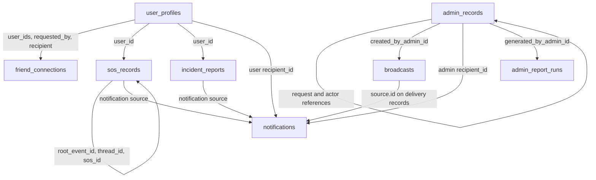

# BeaconDB Schema

## Database status

`BeaconDB` is the database selected by `MONGODB_DB_NAME` in the backend environment. The schema is defined by the reduced Mongoose models in `src/models/Reduced.js`.

The live database was inspected read-only on 2026-09-27. It had exactly eight application collections and 11 documents. Counts are a point-in-time snapshot and can change as the application writes data.

| Collection | Live documents | Purpose |
|---|---:|---|
| `user_profiles` | 2 | App user profiles, contacts, and devices |
| `admin_records` | 1 | Admin accounts and access requests |
| `friend_connections` | 0 | Friend requests and friendships |
| `sos_records` | 6 | SOS cases and events |
| `incident_reports` | 0 | Incident reports and embedded evidence |
| `broadcasts` | 0 | Admin broadcasts |
| `notifications` | 2 | User/admin notifications and broadcast deliveries |
| `admin_report_runs` | 0 | Generated report history |

All document identifiers use MongoDB `ObjectId`. References described below are application-managed; MongoDB does not enforce foreign keys. Embedded records have their own `_id` but do not create separate collections.

## Collections

### `user_profiles`

One document per app user. `firebase_uid` is the external Firebase identity; `beacon_code` is the user-facing friend lookup code.

| Fields | Meaning |
|---|---|
| `_id` | Profile ObjectId used by related records |
| `firebase_uid`, `email` | Required unique identity values |
| `full_name` | Required name, maximum 50 characters |
| `phone_number`, `profile_image_url` | Optional profile details |
| `role` | `citizen` or `student`; defaults to `citizen` |
| `status` | `active` or `deactivated`; defaults to `active` |
| `beacon_code` | Optional unique sparse code, maximum 12 characters |
| `emergency_contacts[]` | Embedded contact: `_id`, `contact_name`, `phone_number`, `relation`, `is_primary`, timestamps |
| `devices[]` | Embedded device: `_id`, `fcm_token`, `platform`, `is_active`, timestamps |
| `created_at`, `updated_at` | Timestamps |

Device `platform` is `android`, `ios`, or `web`. Contact names and phone numbers are required in each embedded contact; device tokens are required in each embedded device.

### `admin_records`

Typed records share one collection. `record_type` is `account` or `access_request`.

| Fields | Meaning |
|---|---|
| Account | `email`, `password_hash`, `full_name`, `role`, `status`, timestamps |
| Authorization | `permissions[]`, `role_definition`, `permission_definitions[]` |
| Access request | `personnel_admin_id`, `requested_by_admin_id`, `reviewed_by_admin_id`, `status`, `note`, `decision_note`, `reviewed_at`, timestamps |

Account roles are `admin` or `personnel`. Passwords are stored as hashes, never plaintext. Access request references point to account `_id` values in this collection.

### `friend_connections`

Typed records use `record_type: "request"` or `record_type: "friendship"`.

| Fields | Meaning |
|---|---|
| `user_ids[]` | Exactly two user profile ObjectIds |
| `requested_by`, `recipient` | Sender and recipient for request records |
| `status` | `pending`, `accepted`, `declined`, or `cancelled` |
| `created_at`, `updated_at`, `accepted_at` | Request/friendship timestamps |

### `sos_records`

Typed records use `record_type: "case"` or `record_type: "event"`. Cases hold current state; events preserve the activity history.

| Fields | Meaning |
|---|---|
| `user_id` | Owner profile ObjectId |
| `root_event_id` | Case's root event ObjectId |
| `thread_id` | Event's case ObjectId |
| `sos_id` | Event/root SOS ObjectId |
| `latest_status`, `status`, `event_type` | Case state and event details |
| `emergency_category`, `latitude`, `longitude`, `address`, `message` | SOS details |
| `acknowledged_by_admin_id`, `actor_admin_id` | Admin account ObjectIds |
| `acknowledged_at`, `resolved_at`, `terminal_status`, `resolved_source`, timestamps | Response and resolution details |

`latest_status` is `active` or `resolved`. Event `status` can be `active`, `resolved`, `acknowledged`, `cancelled`, or `safe`. `event_type` is `report_created`, `status_update`, `admin_acknowledged`, or `note`.

### `incident_reports`

One document per report. `user_id` refers to the reporting profile. Evidence is embedded in `evidence[]` with `_id`, `image_url` and/or `image_data`, `content_type`, `sort_order`, and `created_at`.

Other fields include `incident_type`, `description`, optional location/address, `status`, `priority`, `assigned_department`, `resolution_notes`, timestamps, `dispatched_at`, and `resolved_at`. Status is `pending`, `dispatched`, `in_progress`, or `resolved`; priority is `critical`, `high`, `medium`, or `low`.

### `broadcasts`

Broadcast documents contain `title`, `body`, `severity`, `audience_type`, optional `audience_roles[]`, `created_by_admin_id`, `is_active`, `sent_at`, and timestamps. The creator is an admin account ObjectId. Severity is `announcement`, `warning`, or `danger`; audience type is `all` or `role`.

### `notifications`

Typed records use `record_type: "user"`, `"admin"`, or `"broadcast_delivery"`. Each record has `recipient_type`, `recipient_id`, `type`, `title`, `message`, optional `source`, `metadata`, `is_read`, delivery/acknowledgement timestamps, and `created_at`.

`recipient_id` refers to `user_profiles._id` when `recipient_type` is `user`, and to an account `_id` in `admin_records` when it is `admin`. Broadcast delivery records use a source such as `{ type: "broadcast", id: <broadcast ObjectId> }`. Incident and SOS user notifications can reference `incident_reports` or `sos_records` through `source` and metadata.

### `admin_report_runs`

One document per generated report. Fields are `report_key`, `range_key`, `timezone`, optional `generated_by_admin_id`, `generated_at`, and `payload_hash`. The generator is an admin account ObjectId. Report keys are `daily_safety_report`, `weekly_safety_report`, or `monthly_safety_report`; ranges are `24h`, `7d`, or `30d`.

## Relationships

Emergency contacts, devices, and incident evidence are embedded arrays within their parent document; they are not collections or cross-document relationships.

## Live indexes

The live indexes below were read from `BeaconDB`. MongoDB's automatic `_id_` index is omitted here.

| Collection | Indexes |
|---|---|
| `user_profiles` | Unique `firebase_uid`; unique `email`; unique sparse `beacon_code`; unique sparse `devices.fcm_token` |
| `admin_records` | Unique `email` for `record_type: "account"`; `(personnel_admin_id, status, created_at DESC)` for access requests |
| `friend_connections` | `(user_ids, record_type, status, created_at DESC)`; `(requested_by, status, created_at DESC)` |
| `sos_records` | `(record_type, latest_status, updated_at DESC)`; `(record_type, thread_id, created_at DESC)`; `(record_type, sos_id, created_at DESC)` |
| `incident_reports` | `(status, created_at DESC)`; `(priority, created_at DESC)`; `(user_id, created_at DESC)` |
| `broadcasts` | `(created_at DESC)`; `(sent_at DESC)` |
| `notifications` | `(recipient_type, recipient_id, created_at DESC)`; `(source)`; unique `(source.id, recipient_id)` for broadcast delivery records |
| `admin_report_runs` | `(report_key, range_key, timezone, generated_at DESC)`; `(generated_at DESC)` |

## Source of truth

- Field definitions, Mongoose validation rules, and expected indexes: `src/models/Reduced.js`.
- Collection names, current document counts, and live indexes: read-only inspection of the configured `BeaconDB` database on 2026-09-27.
- This document contains schema metadata and aggregate counts only. It does not include credentials, password hashes, tokens, or personal record contents.
