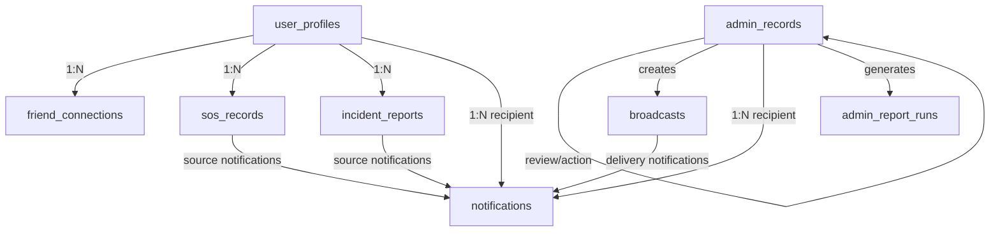

# Beacon MongoDB Collection Reduction Plan

## Goal

Reduce the current 19 collections to 8 while preserving application records, histories, and relationships. Switch internal and API identifiers from numeric `public_id` values to MongoDB ObjectId strings. `firebase_uid` and `beacon_code` remain external identifiers.

## Target Collections

| Collection | Contents | Main relationships |
|---|---|---|
| `user_profiles` | User profiles with embedded `emergency_contacts[]` and `devices[]` | Firebase identity; owned records refer to the profile `_id` |
| `admin_records` | Admin accounts and access requests, distinguished by `record_type` | Requests refer to account `_id`; account records hold role and permission definitions |
| `friend_connections` | Friend requests and accepted friendship records, distinguished by `record_type` | User ObjectIds in `user_ids[]`; requests retain sender and recipient |
| `sos_records` | SOS cases and individual SOS events, distinguished by `record_type` | Case and event records refer to user, admin, root event, and case ObjectIds |
| `incident_reports` | Incident reports with embedded `evidence[]` | Each report refers to a user profile |
| `broadcasts` | Broadcast records | Creator refers to an admin account in `admin_records` |
| `notifications` | Admin notifications, user notifications, and broadcast deliveries, distinguished by `record_type` | Recipient ObjectId plus optional typed source ObjectId |
| `admin_report_runs` | Generated report history | Generator refers to an admin account in `admin_records` |

## Source Mapping

| Existing collection | Target | Transformation |
|---|---|---|
| `user_profiles` | `user_profiles` | Remove `public_id`; preserve `_id` |
| `emergency_contacts`, `devices` | `user_profiles` | Embed each child under its owner |
| `admin_accounts`, `admin_access_requests` | `admin_records` | Preserve separate documents and mark their record type |
| `roles`, `permissions` | `admin_records` | Copy role/permission definitions onto account records; use scalar role and permission names |
| `friend_requests`, `friendships` | `friend_connections` | Preserve every request and friendship as a separate typed record |
| `sos_threads`, `sos_events` | `sos_records` | Preserve each case and event as a separate typed record |
| `incident_reports`, `incident_evidence` | `incident_reports` | Embed evidence under its report |
| `broadcasts` | `broadcasts` | Preserve document and convert creator/audience references |
| `notifications`, `user_notifications`, `broadcast_user_deliveries` | `notifications` | Preserve every item and mark its recipient and record type |
| `admin_report_runs` | `admin_report_runs` | Preserve history and convert generator reference |
| `counters` | Removed | No longer needed after numeric ID generation is removed |

References that cannot be resolved must stop migration with an error. Migration keeps source `_id` values for existing documents and replaces numeric references with those ObjectIds. Embedded children keep their existing `_id` values.

## Relationship Summary

## Execution Stages

1. **Protect source data.** Keep the compressed archive outside the repository and prove it restores into an isolated MongoDB instance.
2. **Build the new schemas and migration.** Migrate into a new, uniquely named database. The script refuses to use the source database as its target, requires an empty target name, keeps all source collections, and never drops the source.
3. **Verify the rehearsal.** Check all eight collection totals, embedded child totals, retained history types, indexes, and every ObjectId relationship. Fix conversion errors before API cutover.
4. **Switch backend APIs.** Use ObjectId strings for identifiers and references. Update authentication claims, authorization lookups, route parameters, sorting, notifications, and all CRUD flows. Remove `Counter` and old collection models only after every caller is converted.
5. **Update clients together.** Update the admin frontend and mobile app to treat IDs as opaque strings and send/receive the new ObjectId values. Deploy clients and backend as one coordinated breaking change.
6. **Stage and smoke test.** Point the backend to the rehearsed reduced database. Verify admin and mobile login, profiles, contacts/devices, friends, SOS, incidents/evidence, broadcasts, notifications, and report history.
7. **Cut over reversibly.** Pause writes, create a fresh migration target from a new backup, compare source/target counts and relationships, then point the local backend at the reduced database. Keep the original database unchanged through the soak period.
8. **Contract only after approval.** Drop or archive the original collections only after the coordinated release has passed smoke checks and the rollback window is accepted.

## Current Execution Record

- Backup archive SHA-256 verified: `BB9FA1BDA92F8C8AF777333A582650FB9A42946F651AE61242AE2412D45268A3`.
- Isolated local restore succeeded with MongoDB Database Tools 100.19.0 and MongoDB Server 8.0.9: 19 collections, 475 documents, zero restore failures.
- A local migration rehearsal produced exactly 8 collections and 448 top-level documents. It retained 4 embedded devices, 14 friend requests, 1 friendship, 15 SOS cases, 17 SOS events, 230 broadcast deliveries, 3 user notifications, and 25 admin notifications. Relationship checks passed.
- Backend API code now reads and writes only the eight reduced collections and returns ObjectId strings. Application source has no imports of the legacy collection models; a module-load check confirmed only the eight target collections are registered.
- Admin web ID handling and Android DTO/API ID types now accept opaque strings. The admin production build succeeded; Android `:app:testDebugUnitTest` succeeded.
- The complete `npm.cmd test` chain passed after updating notification, broadcast, authorization, and regression fixtures to the reduced schema. These tests mock Mongo operations; no API smoke test against the reduced rehearsal database has been run.
- JavaScript syntax checks passed for `src`, `scripts`, and `test`. The admin production build and Android `:app:testDebugUnitTest` passed.
- No source collections or records were modified. Local API smoke testing, coordinated client/backend cutover, soak, and source collection removal remain pending.
- Provisioned the configured database `BeaconDB` with exactly the eight planned collections and reduced-schema indexes. Seeded one active default administrator (`admin@beacon.local`) with all backend permissions and verified login through the real admin login handler. Other records remain unmigrated. A read-only migration dry run confirmed `BeaconDB` is not the legacy source database; no source collections or records were copied or changed.
