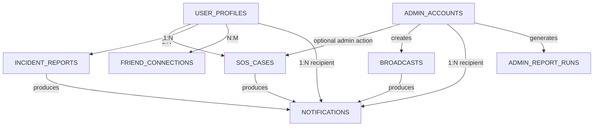

# Beacon MongoDB Final Collection Reduction Plan

## 1. Goal

The goal of this database redesign is to reduce the current MongoDB structure from **19 collections to 8 main collections** while keeping the important Beacon features and relationships clear.

The redesign focuses on:

- reducing unnecessary collections
- embedding small child data inside their parent documents
- merging collections that represent the same workflow
- using MongoDB `ObjectId` references between major collections
- keeping the structure simple enough for a student project
- preserving the important mobile/client and web/admin features
- making the database easier to understand, maintain, and query

---

## 2. Final Collection Structure

The proposed final database will contain the following **8 collections**:

| # | Collection | Main Purpose |
|---|---|---|
| 1 | `user_profiles` | Mobile users, emergency contacts, and registered devices |
| 2 | `admin_accounts` | Admin/personnel accounts, permissions, and access requests |
| 3 | `friend_connections` | Friend requests and accepted friendships |
| 4 | `sos_cases` | SOS case information and SOS event history |
| 5 | `incident_reports` | Incident reports and attached evidence |
| 6 | `broadcasts` | Admin-created announcements and warnings |
| 7 | `notifications` | Notifications for users and administrators |
| 8 | `admin_report_runs` | Generated administrative report history |

---

## 3. Current to Final Collection Mapping

| Current Collection | Final Location | Action |
|---|---|---|
| `user_profiles` | `user_profiles` | Keep |
| `emergency_contacts` | `user_profiles.emergency_contacts[]` | Embed |
| `devices` | `user_profiles.devices[]` | Embed |
| `admin_accounts` | `admin_accounts` | Keep |
| `roles` | `admin_accounts.role` | Remove collection |
| `permissions` | `admin_accounts.permissions[]` | Remove collection |
| `admin_access_requests` | `admin_accounts.access_requests[]` | Embed |
| `friend_requests` | `friend_connections` | Merge |
| `friendships` | `friend_connections` | Merge |
| `sos_threads` | `sos_cases` | Merge |
| `sos_events` | `sos_cases.events[]` | Embed |
| `incident_reports` | `incident_reports` | Keep |
| `incident_evidence` | `incident_reports.evidence[]` | Embed |
| `broadcasts` | `broadcasts` | Keep |
| `broadcast_user_deliveries` | `notifications` | Merge |
| `user_notifications` | `notifications` | Merge |
| `notifications` | `notifications` | Merge |
| `admin_report_runs` | `admin_report_runs` | Keep |
| `counters` | Removed | Use MongoDB `_id` |

---

# 4. Mobile / Client Side Collections

The mobile side mainly uses:

- `user_profiles`
- `friend_connections`
- `sos_cases`
- `incident_reports`
- `notifications`

Some data is embedded directly inside the main documents instead of having a separate collection.

---

## 4.1 `user_profiles`

This remains the main collection for students and residents using the Beacon mobile app.

### Embedded Data

The following current collections will be moved inside the user profile:

- `emergency_contacts`
- `devices`

### Proposed Structure

```js
user_profiles {
    _id: ObjectId,

    firebase_uid: String,
    full_name: String,
    email: String,
    phone_number: String,
    profile_image_url: String,

    role: "citizen" | "student",
    status: "active" | "deactivated",

    beacon_code: String,

    emergency_contacts: [
        {
            _id: ObjectId,
            contact_name: String,
            phone_number: String,
            relation: String,
            is_primary: Boolean
        }
    ],

    devices: [
        {
            _id: ObjectId,
            fcm_token: String,
            platform: "android" | "ios" | "web",
            is_active: Boolean,
            created_at: Date,
            updated_at: Date
        }
    ],

    created_at: Date,
    updated_at: Date
}
```

### Reason

Emergency contacts and devices belong directly to one user. They normally do not need to exist independently from the user profile.

Instead of:

```text
user_profiles
   ├── emergency_contacts
   └── devices
```

the structure becomes:

```text
user_profiles
   ├── emergency_contacts[]
   └── devices[]
```

This removes two separate collections.

---

## 4.2 `friend_connections`

The current database separates:

- `friend_requests`
- `friendships`

These two collections can be combined because they represent the same relationship between two users.

### Proposed Structure

```js
friend_connections {
    _id: ObjectId,

    user_ids: [
        ObjectId,
        ObjectId
    ],

    requested_by: ObjectId,

    status:
        "pending" |
        "accepted" |
        "declined" |
        "cancelled",

    created_at: Date,
    updated_at: Date,
    accepted_at: Date
}
```

### Workflow

```text
User A sends request
        ↓
status = pending
        ↓
User B accepts
        ↓
status = accepted
```

A new friendship document no longer needs to be created after the request is accepted.

### Relationship

```text
USER_PROFILES
      │
      │ N:M
      ▼
FRIEND_CONNECTIONS
```

---

## 4.3 `sos_cases`

The current database separates SOS information into:

- `sos_threads`
- `sos_events`

These can be combined into one main SOS document.

### Proposed Structure

```js
sos_cases {
    _id: ObjectId,

    user_id: ObjectId,

    emergency_category:
        "medical" |
        "fire" |
        "violence" |
        "unknown",

    status:
        "active" |
        "resolved" |
        "cancelled" |
        "safe",

    location: {
        latitude: Number,
        longitude: Number,
        address: String
    },

    assigned_unit: String,

    acknowledged_by_admin_id: ObjectId,
    acknowledged_at: Date,

    resolved_at: Date,
    terminal_status: String,

    events: [
        {
            _id: ObjectId,

            event_type:
                "report_created" |
                "status_update" |
                "admin_acknowledged" |
                "note",

            status: String,

            actor_type:
                "user" |
                "admin",

            actor_admin_id: ObjectId,

            message: String,

            location: {
                latitude: Number,
                longitude: Number,
                address: String
            },

            created_at: Date
        }
    ],

    created_at: Date,
    updated_at: Date
}
```

### Result

Instead of:

```text
sos_threads
    ↕
sos_events
```

the structure becomes:

```text
SOS_CASE
   └── events[]
```

### Relationships

```text
USER_PROFILES 1 ───── N SOS_CASES

ADMIN_ACCOUNTS 1 ───── N SOS_CASES
                        optional admin action
```

---

## 4.4 `incident_reports`

The main incident report collection remains, but evidence will be embedded directly inside each report.

### Proposed Structure

```js
incident_reports {
    _id: ObjectId,

    user_id: ObjectId,

    incident_type: String,
    description: String,

    location: {
        latitude: Number,
        longitude: Number,
        address: String
    },

    status:
        "pending" |
        "dispatched" |
        "in_progress" |
        "resolved",

    priority:
        "critical" |
        "high" |
        "medium" |
        "low",

    assigned_department: String,

    evidence: [
        {
            _id: ObjectId,
            image_url: String,
            content_type: String,
            sort_order: Number,
            created_at: Date
        }
    ],

    resolution_notes: String,

    created_at: Date,
    updated_at: Date,
    dispatched_at: Date,
    resolved_at: Date
}
```

### Result

Instead of:

```text
incident_reports
      │
      └── incident_evidence
```

the structure becomes:

```text
incident_reports
      └── evidence[]
```

### Relationship

```text
USER_PROFILES
      1
      │
      ▼
      N
INCIDENT_REPORTS
```

---

# 5. Web / Admin Side Collections

The admin side mainly uses:

- `admin_accounts`
- `sos_cases`
- `incident_reports`
- `broadcasts`
- `notifications`
- `admin_report_runs`

---

## 5.1 `admin_accounts`

The admin account collection will also store permissions and access requests.

The current separate collections for `roles`, `permissions`, and `admin_access_requests` will no longer be required.

### Proposed Structure

```js
admin_accounts {
    _id: ObjectId,

    email: String,
    password_hash: String,
    full_name: String,

    role:
        "admin" |
        "personnel",

    permissions: [
        String
    ],

    status:
        "active" |
        "deactivated",

    access_requests: [
        {
            _id: ObjectId,

            requested_by_admin_id: ObjectId,

            status:
                "pending" |
                "approved" |
                "rejected" |
                "cancelled",

            note: String,
            decision_note: String,

            reviewed_by_admin_id: ObjectId,
            reviewed_at: Date,

            created_at: Date,
            updated_at: Date
        }
    ],

    created_at: Date,
    updated_at: Date
}
```

### Removed Collections

```text
roles
permissions
admin_access_requests
```

### Result

```text
ADMIN_ACCOUNTS
   ├── role
   ├── permissions[]
   └── access_requests[]
```

---

## 5.2 `broadcasts`

Broadcasts should remain as a separate collection because they are system-wide records created by administrators.

### Proposed Structure

```js
broadcasts {
    _id: ObjectId,

    title: String,
    body: String,

    severity:
        "announcement" |
        "warning" |
        "danger",

    audience_type:
        "all" |
        "role",

    audience_roles: [
        String
    ],

    created_by_admin_id: ObjectId,

    is_active: Boolean,
    sent_at: Date,

    created_at: Date,
    updated_at: Date
}
```

### Relationship

```text
ADMIN_ACCOUNTS
      1
      │
      │ creates
      ▼
      N
BROADCASTS
```

---

## 5.3 `notifications`

The current database uses separate collections for:

- `user_notifications`
- admin `notifications`
- `broadcast_user_deliveries`

These will be merged into one collection.

### Proposed Structure

```js
notifications {
    _id: ObjectId,

    recipient_type:
        "user" |
        "admin",

    recipient_id: ObjectId,

    type:
        "broadcast" |
        "sos" |
        "incident" |
        "admin_access" |
        "system",

    title: String,
    message: String,

    source: {
        type:
            "broadcast" |
            "sos_case" |
            "incident_report",

        id: ObjectId
    },

    metadata: {},

    is_read: Boolean,

    delivered_at: Date,
    acknowledged_at: Date,

    created_at: Date
}
```

### Relationships

```text
USER_PROFILES ────────► NOTIFICATIONS

ADMIN_ACCOUNTS ───────► NOTIFICATIONS

BROADCASTS ───────────► NOTIFICATIONS

SOS_CASES ────────────► NOTIFICATIONS

INCIDENT_REPORTS ─────► NOTIFICATIONS
```

The `source` field identifies which system record caused the notification.

---

## 5.4 `admin_report_runs`

This collection should remain separate because generated reports create historical records that may continue growing.

### Proposed Structure

```js
admin_report_runs {
    _id: ObjectId,

    report_key:
        "daily_safety_report" |
        "weekly_safety_report" |
        "monthly_safety_report",

    range_key:
        "24h" |
        "7d" |
        "30d",

    timezone: String,

    generated_by_admin_id: ObjectId,

    generated_at: Date,

    payload_hash: String
}
```

### Relationship

```text
ADMIN_ACCOUNTS
      1
      │
      │ generates
      ▼
      N
ADMIN_REPORT_RUNS
```

---

# 6. Remove `counters`

The current database uses numeric `public_id` values and a `counters` collection to generate sequential IDs.

The proposed design will use the built-in MongoDB:

```text
_id: ObjectId
```

for internal document relationships.

### Current Example

```js
{
    public_id: 15,
    user_id: 20
}
```

### Proposed Example

```js
{
    _id: ObjectId("..."),
    user_id: ObjectId("...")
}
```

Because of this, the `counters` collection can be removed.

User-facing or external identifiers can still remain when needed, such as:

```text
firebase_uid
beacon_code
```

---

# 7. Final Database Relationships



---

# 8. Embedded Data Structure

The following data will no longer need their own collection.

```text
USER_PROFILES
 ├── emergency_contacts[]
 └── devices[]

ADMIN_ACCOUNTS
 ├── permissions[]
 └── access_requests[]

SOS_CASES
 └── events[]

INCIDENT_REPORTS
 └── evidence[]
```

---

# 9. Final Mobile / Client Side Connection

```text
                    USER_PROFILES
                         │
          ┌──────────────┼──────────────┐
          │              │              │
          ▼              ▼              ▼
 FRIEND_CONNECTIONS   SOS_CASES    INCIDENT_REPORTS
        N:M              1:N             1:N
                         │                │
                     events[]         evidence[]
                         │                │
                         └──────┬─────────┘
                                │
                                ▼
                         NOTIFICATIONS
```

### Mobile Features Supported

- account/profile management
- emergency contacts
- registered devices
- SOS panic button
- SOS status updates
- incident reporting
- evidence/photos
- friend requests
- friendships
- user notifications
- broadcast notifications

---

# 10. Final Web / Admin Side Connection

```text
                      ADMIN_ACCOUNTS
                        │    │    │
             ┌──────────┘    │    └─────────────┐
             │               │                  │
             ▼               ▼                  ▼
        SOS_CASES        BROADCASTS       ADMIN_REPORT_RUNS
             │               │
             │               ▼
             │         NOTIFICATIONS
             │               ▲
             ▼               │
     INCIDENT_REPORTS ────────┘
```

### Admin Features Supported

- administrator/personnel accounts
- permissions
- admin access requests
- SOS monitoring
- SOS acknowledgement and response
- incident report verification
- incident status updates
- broadcasts
- admin notifications
- report generation history

---

# 11. Final Collection Relationship Summary

| Collection | Connected To | Relationship |
|---|---|---|
| `user_profiles` | `friend_connections` | N:M |
| `user_profiles` | `sos_cases` | 1:N |
| `user_profiles` | `incident_reports` | 1:N |
| `user_profiles` | `notifications` | 1:N |
| `admin_accounts` | `sos_cases` | 1:N optional admin action |
| `admin_accounts` | `broadcasts` | 1:N |
| `admin_accounts` | `notifications` | 1:N |
| `admin_accounts` | `admin_report_runs` | 1:N |
| `broadcasts` | `notifications` | 1:N |
| `sos_cases` | `notifications` | 1:N |
| `incident_reports` | `notifications` | 1:N |

---

# 12. Implementation Plan

The migration should be done gradually so the current working database is not immediately broken.

## Phase 1 — Create the New Schemas

Create the new Mongoose models first:

```text
user_profiles
admin_accounts
friend_connections
sos_cases
incident_reports
broadcasts
notifications
admin_report_runs
```

Do not delete the old collections yet.

---

## Phase 2 — Standardize Relationships

Change new relationships to use:

```text
ObjectId
```

instead of numeric `public_id` values.

Main references:

```text
sos_cases.user_id
incident_reports.user_id
friend_connections.user_ids[]
broadcasts.created_by_admin_id
notifications.recipient_id
admin_report_runs.generated_by_admin_id
```

---

## Phase 3 — Update User Profiles

Move:

```text
emergency_contacts
devices
```

into:

```text
user_profiles
```

as embedded arrays.

Update the mobile APIs that manage emergency contacts and device registration.

---

## Phase 4 — Merge Friend Collections

Replace:

```text
friend_requests
friendships
```

with:

```text
friend_connections
```

Update the friend workflow so acceptance only updates the existing connection status.

---

## Phase 5 — Merge SOS Collections

Replace:

```text
sos_threads
sos_events
```

with:

```text
sos_cases
```

Move SOS history into:

```text
sos_cases.events[]
```

Update both mobile SOS APIs and admin SOS monitoring routes.

---

## Phase 6 — Embed Incident Evidence

Move evidence documents from:

```text
incident_evidence
```

into:

```text
incident_reports.evidence[]
```

Update the incident submission and verification APIs.

---

## Phase 7 — Simplify Admin Accounts

Remove dependencies on:

```text
roles
permissions
admin_access_requests
```

Store the required information directly inside:

```text
admin_accounts
```

using:

```text
role
permissions[]
access_requests[]
```

---

## Phase 8 — Merge Notification Collections

Replace:

```text
user_notifications
notifications
broadcast_user_deliveries
```

with one:

```text
notifications
```

Use:

```text
recipient_type
recipient_id
type
source
```

to determine the notification owner and origin.

---

## Phase 9 — Remove Sequential Public ID Dependency

Update new database relationships to use MongoDB `ObjectId`.

After the application no longer depends on sequential `public_id` generation, remove:

```text
counters
```

Keep user-facing identifiers such as `firebase_uid` and `beacon_code` where they are still needed.

---

## Phase 10 — Migrate Existing Data

Create a migration script that:

1. copies existing user data
2. embeds emergency contacts
3. embeds devices
4. converts friend requests and friendships
5. converts SOS threads and events into SOS cases
6. embeds incident evidence
7. converts admin roles and permissions
8. embeds admin access requests
9. combines notification data
10. converts important references to `ObjectId`

The old collections should remain available during migration for checking and rollback.

---

## Phase 11 — Test the Mobile App

Test the following:

- login and profile
- emergency contacts
- device registration / FCM
- SOS creation
- SOS updates
- incident submission
- evidence upload
- friend request
- friend acceptance
- notifications
- broadcasts

---

## Phase 12 — Test the Admin Dashboard

Test:

- admin login
- user management
- admin account management
- SOS monitoring
- SOS acknowledgement
- incident verification
- incident status updates
- broadcast creation
- admin notifications
- report generation

---

## Phase 13 — Verify Data Consistency

Before deleting the old collections, compare:

- total users
- admins
- active SOS cases
- SOS event history
- incident reports
- incident evidence
- friend relationships
- broadcasts
- notifications
- report runs

No important data should be missing after migration.

---

## Phase 14 — Remove Old Collections

Only after the new database and application are working properly should the following old collections be removed:

```text
emergency_contacts
devices
roles
permissions
admin_access_requests
friend_requests
friendships
sos_threads
sos_events
incident_evidence
broadcast_user_deliveries
user_notifications
counters
```

The old admin `notifications` collection is replaced by the new unified `notifications` collection during migration.

---

# 13. Final Database Structure

```text
Beacon-Admin
│
├── user_profiles
│   ├── emergency_contacts[]
│   └── devices[]
│
├── admin_accounts
│   ├── permissions[]
│   └── access_requests[]
│
├── friend_connections
│
├── sos_cases
│   └── events[]
│
├── incident_reports
│   └── evidence[]
│
├── broadcasts
│
├── notifications
│
└── admin_report_runs
```

---

# 14. Final Result

### Current Database

```text
19 collections
```

### Proposed Database

```text
8 collections
```

### Collections Reduced

```text
11 fewer main collections
```

The final structure keeps the major Beacon features while removing collections that can be embedded or merged. Major system records remain separate, while small child data stays inside its parent document.

This keeps the MongoDB database simpler and more suitable for the current Beacon student project without removing the important connections between the mobile/client side and the web/admin side.
