# Database Schema and ERD

## 1. Database Overview

- **Database Type:** MongoDB Atlas
- **Database Name:** `Beacon-Admin`
- **ODM/Driver:** Mongoose
- **Total Collections:** 19
- **Live Documents:** 475
- **Inspection Date:** 2026-09-26
- **Connection:** `MONGODB_URI`; `server.js` loads `.env` with `dotenv/config`, and `src/mongo.js` calls `mongoose.connect()`.

Beacon stores user and administrator profiles, operational safety reports and SOS events, notification and broadcast delivery records, friendship data, and supporting role and counter data. Mongoose schemas define application validation; the live collections have no MongoDB collection validators.

## 2. Collection Summary

| Collection | Documents | Purpose | Primary Identifier | Main Relationships |
|---|---:|---|---|---|
| `user_profiles` | 20 | Citizen/student identity and profile | `_id` (ObjectId); `public_id` is unique application ID | Referenced by user-owned records via `public_id` |
| `admin_accounts` | 9 | Administrator and personnel accounts | `_id`; `public_id` unique | `role_id` → `roles.public_id`; referenced by admin activity |
| `roles` | 2 | Administrator role catalog | `_id`; `public_id` and `name` unique | Referenced by `admin_accounts.role_id` |
| `permissions` | 6 | Permission catalog | `_id`; `public_id` and `name` unique | No direct stored reference; account permissions are strings |
| `emergency_contacts` | 0 | User-owned emergency contact details | `_id`; schema defines unique `public_id` | `owner_user_id` → `user_profiles.public_id` |
| `devices` | 4 | User device and push-notification token registration | `_id`; `public_id` unique | `user_id` → `user_profiles.public_id` |
| `friend_requests` | 14 | User-to-user friend requests | `_id`; `public_id` unique | Requester and addressee → user profiles |
| `friendships` | 1 | Accepted user pairings | `_id` | `user_id`, `friend_user_id` → user profiles |
| `sos_threads` | 15 | Current state and assignment of an SOS case | `_id`; `public_id` unique | User profile, root SOS event, admin acknowledgement |
| `sos_events` | 17 | Time-ordered SOS reports and status events | `_id`; `public_id` unique | User profile, SOS thread, optional acting admin |
| `incident_reports` | 21 | User-submitted incidents and operational status | `_id`; `public_id` unique | User profile; optional admin assignment field in schema |
| `incident_evidence` | 0 | Evidence attached to an incident | `_id`; schema defines unique `public_id` | `incident_report_id` → `incident_reports.public_id` |
| `admin_access_requests` | 3 | Personnel requests for administrator access | `_id`; `public_id` unique | Requesting/reviewing accounts → admin accounts |
| `broadcasts` | 20 | Administrator-created announcements | `_id`; `public_id` unique | Creator → admin account; deliveries reference broadcasts |
| `broadcast_user_deliveries` | 230 | Per-user broadcast delivery and acknowledgement | `_id` | Broadcast ObjectId and numeric ID; recipient → user profile |
| `user_notifications` | 3 | Notifications delivered to app users | `_id`; `public_id` unique | `recipient_user_id` → user profile |
| `notifications` | 25 | Notifications delivered to administrators | `_id`; `public_id` unique | `recipient_admin_id` → admin account |
| `admin_report_runs` | 70 | Record of generated administrative reports | `_id`; `public_id` unique | `generated_by_admin_id` → admin account |
| `counters` | 15 | Atomic sequence values used to allocate numeric public IDs | String `_id` | No relationship |

## 3. Collection Schemas

Required/default/constraint details below come from the application’s Mongoose schemas. MongoDB itself does not enforce them through collection validators. `Optional` means the Mongoose path is not marked required; where a stored value may be BSON `null`, that is noted. All dates are BSON dates. Unless stated otherwise, collection documents also have MongoDB `_id: ObjectId`.

### 3.1 Collection: `user_profiles`

| Field | Type | Required | Default | Constraints / Description |
|---|---|---:|---|---|
| `_id` | ObjectId | Yes | Automatic | MongoDB document identifier |
| `public_id` | Number | Yes | — | Positive safe integer; unique application identifier |
| `firebase_uid` | String | Yes | — | Unique; maximum 128 characters; Firebase identity key |
| `full_name` | String | Yes | — | Maximum 50 characters |
| `email` | String | Yes | — | Maximum 320 characters; unique index |
| `phone_number` | String / null | No | — | Maximum 20 characters |
| `profile_image_url` | String / null | No | — | Profile image location |
| `role` | String | Yes | `citizen` | `citizen` or `student` |
| `status` | String | Yes | `active` | `active` or `deactivated` |
| `beacon_code` | String | No | — | Maximum 12 characters; unique sparse index |
| `created_at` | Date | No | Current time | Creation timestamp |
| `updated_at` | Date | No | Current time | Update timestamp |

All 20 stored profiles have every listed field. `phone_number` is observed as both String and null; `profile_image_url` is null in the inspected documents.

### 3.2 Collection: `admin_accounts`

| Field | Type | Required | Default | Constraints / Description |
|---|---|---:|---|---|
| `_id` | ObjectId | Yes | Automatic | MongoDB document identifier |
| `public_id` | Number | Yes | — | Positive safe integer; unique application identifier |
| `email` | String | Yes | — | Maximum 320 characters; unique index |
| `password_hash` | String | Yes | — | Stored password hash; values intentionally omitted |
| `full_name` | String | Yes | — | Administrator/personnel display name |
| `role_id` | Number | Yes | — | Positive safe integer; references `roles.public_id` |
| `role` | String | Yes | — | `admin` or `personnel` |
| `permission_names` | Array<String> | No | `[]` | Permission names stored as strings |
| `status` | String | No | `active` | `active` or `deactivated` |
| `created_at` | Date | No | Current time | Creation timestamp |
| `updated_at` | Date | No | Current time | Update timestamp |

All 9 stored account documents contain every listed field. Permission strings are embedded in this document; `permissions` has no direct reference field from accounts.

### 3.3 Collection: `roles`

| Field | Type | Required | Default | Constraints / Description |
|---|---|---:|---|---|
| `_id` | ObjectId | Yes | Automatic | MongoDB document identifier |
| `public_id` | Number | Yes | — | Positive safe integer; unique |
| `name` | String | Yes | — | Maximum 50 characters; unique |
| `description` | String | No | — | Role description |

### 3.4 Collection: `permissions`

| Field | Type | Required | Default | Constraints / Description |
|---|---|---:|---|---|
| `_id` | ObjectId | Yes | Automatic | MongoDB document identifier |
| `public_id` | Number | Yes | — | Positive safe integer; unique |
| `name` | String | Yes | — | Maximum 50 characters; unique |
| `description` | String | No | — | Permission description |

### 3.5 Collection: `emergency_contacts` (empty)

No documents are currently stored, so live field types and presence cannot be verified. The Mongoose schema defines:

| Field | Type | Required | Default | Constraints / Description |
|---|---|---:|---|---|
| `_id` | ObjectId | Yes | Automatic | MongoDB document identifier |
| `public_id` | Number | Yes | — | Positive safe integer; unique |
| `owner_user_id` | Number | Yes | — | Positive safe integer; logical reference to user profile |
| `contact_name` | String | Yes | — | Maximum 100 characters |
| `phone_number` | String | Yes | — | Maximum 30 characters |
| `relation` | String | No | — | Maximum 50 characters |
| `is_primary` | Boolean | No | `false` | Whether this is a primary contact |
| `created_at` | Date | No | Current time | Creation timestamp |
| `updated_at` | Date | No | Current time | Update timestamp |

### 3.6 Collection: `devices`

| Field | Type | Required | Default | Constraints / Description |
|---|---|---:|---|---|
| `_id` | ObjectId | Yes | Automatic | MongoDB document identifier |
| `public_id` | Number | Yes | — | Positive safe integer; unique |
| `user_id` | Number | Yes | — | Positive safe integer; logical reference to user profile |
| `fcm_token` | String | Yes | — | Unique index; sensitive token values omitted |
| `platform` | String | No | `android` | `android`, `ios`, or `web` |
| `is_active` | Boolean | No | `true` | Device registration state |
| `created_at` | Date | No | Current time | Creation timestamp |
| `updated_at` | Date | No | Current time | Update timestamp |

All 4 stored documents contain these fields. The live values use `android` for `platform`.

### 3.7 Collection: `friend_requests`

| Field | Type | Required | Default | Constraints / Description |
|---|---|---:|---|---|
| `_id` | ObjectId | Yes | Automatic | MongoDB document identifier |
| `public_id` | Number | Yes | — | Positive safe integer; unique |
| `requester_user_id` | Number | Yes | — | Positive safe integer; user profile public ID |
| `addressee_user_id` | Number | Yes | — | Positive safe integer; user profile public ID |
| `status` | String | No | `pending` | `pending`, `accepted`, `declined`, or `cancelled` |
| `created_at` | Date | No | Current time | Creation timestamp |
| `updated_at` | Date | No | Current time | Update timestamp |

### 3.8 Collection: `friendships`

| Field | Type | Required | Default | Constraints / Description |
|---|---|---:|---|---|
| `_id` | ObjectId | Yes | Automatic | MongoDB document identifier |
| `user_id` | Number | Yes | — | Positive safe integer; one user in the pair |
| `friend_user_id` | Number | Yes | — | Positive safe integer; other user in the pair |
| `created_at` | Date | No | Current time | Creation timestamp |

The ordered pair has a unique compound index. Application queries treat the pair symmetrically.

### 3.9 Collection: `sos_threads`

| Field | Type | Required | Default | Constraints / Description |
|---|---|---:|---|---|
| `_id` | ObjectId | Yes | Automatic | MongoDB document identifier |
| `public_id` | Number | Yes | — | Positive safe integer; unique |
| `root_event_id` | Number | Yes | — | Positive safe integer; SOS event `public_id` for the root event |
| `user_id` | Number | Yes | — | Positive safe integer; user profile public ID |
| `latest_status` | String | No | `active` | `active` or `resolved` |
| `emergency_category` | String | No | `unknown` | `medical`, `fire`, `violence`, or `unknown` |
| `acknowledged_at` | Date | No | — | Admin acknowledgement time |
| `acknowledged_by_admin_id` | Number | No | — | Administrator public ID |
| `resolved_at` | Date | No | — | Resolution time |
| `assigned_unit` | String | No | — | Assigned response unit |
| `terminal_status` | String | No | — | `cancelled` or `safe` |
| `resolved_source` | String | No | — | `android` |
| `created_at` | Date | No | Current time | Creation timestamp |
| `updated_at` | Date | No | Current time | Update timestamp |

Nullable or optional operational fields are not present on every thread. In the live database, 15 threads were stored.

### 3.10 Collection: `sos_events`

| Field | Type | Required | Default | Constraints / Description |
|---|---|---:|---|---|
| `_id` | ObjectId | Yes | Automatic | MongoDB document identifier |
| `public_id` | Number | Yes | — | Positive safe integer; unique |
| `user_id` | Number | Yes | — | Positive safe integer; user profile public ID |
| `sos_id` | Number | Yes | — | Positive safe integer; root SOS event public ID used as case ID |
| `thread_id` | Number | Yes | — | Positive safe integer; `sos_threads.public_id` |
| `latitude` | Number | No | — | Latitude |
| `longitude` | Number | No | — | Longitude |
| `address` | String | No | — | Human-readable location; absent in some documents |
| `message` | String | No | — | Event message; absent in some documents |
| `status` | String | No | `active` | `active`, `resolved`, `acknowledged`, `cancelled`, or `safe` |
| `actor_type` | String | No | `user` | `user` or `admin` |
| `actor_admin_id` | Number | No | — | Admin account public ID when an administrator acted |
| `event_type` | String | No | `status_update` | `report_created`, `status_update`, `admin_acknowledged`, or `note` |
| `emergency_category` | String | No | — | `medical`, `fire`, `violence`, or `unknown` |
| `created_at` | Date | No | Current time | Event timestamp |

### 3.11 Collection: `incident_reports`

| Field | Type | Required | Default | Constraints / Description |
|---|---|---:|---|---|
| `_id` | ObjectId | Yes | Automatic | MongoDB document identifier |
| `public_id` | Number | Yes | — | Positive safe integer; unique |
| `user_id` | Number | Yes | — | Positive safe integer; user profile public ID |
| `incident_type` | String | Yes | — | Maximum 50 characters |
| `description` | String | Yes | — | Incident description |
| `latitude` | Number | No | — | Latitude |
| `longitude` | Number | No | — | Longitude |
| `address` | String | No | — | Human-readable location |
| `status` | String | No | `pending` | `pending`, `dispatched`, `in_progress`, or `resolved` |
| `priority` | String | No | `medium` | `critical`, `high`, `medium`, or `low` |
| `assigned_department` | String | No | — | Assigned department |
| `assigned_admin_id` | Number | No | — | Legacy/optional schema field; not present in any live document |
| `resolution_notes` | String | No | — | Resolution details |
| `created_at` | Date | No | Current time | Creation timestamp |
| `updated_at` | Date | No | Current time | Update timestamp |
| `dispatched_at` | Date | No | — | Dispatch time |
| `resolved_at` | Date | No | — | Resolution time |

### 3.12 Collection: `incident_evidence` (empty)

No documents are currently stored; actual field types and presence cannot be verified. The Mongoose schema defines:

| Field | Type | Required | Default | Constraints / Description |
|---|---|---:|---|---|
| `_id` | ObjectId | Yes | Automatic | MongoDB document identifier |
| `public_id` | Number | Yes | — | Positive safe integer; unique |
| `incident_report_id` | Number | Yes | — | Positive safe integer; incident report public ID |
| `image_url` | String | No | — | Optional evidence URL |
| `image_data` | Binary | No | — | Optional image bytes (Mongoose Buffer) |
| `content_type` | String | No | — | Maximum 100 characters |
| `sort_order` | Number | No | `0` | Evidence ordering value |
| `created_at` | Date | No | Current time | Creation timestamp |

### 3.13 Collection: `admin_access_requests`

| Field | Type | Required | Default | Constraints / Description |
|---|---|---:|---|---|
| `_id` | ObjectId | Yes | Automatic | MongoDB document identifier |
| `public_id` | Number | Yes | — | Positive safe integer; unique |
| `personnel_admin_id` | Number | Yes | — | Personnel account public ID |
| `requested_by_admin_id` | Number | Yes | — | Requesting account public ID |
| `status` | String | No | `pending` | `pending`, `approved`, `rejected`, or `cancelled` |
| `note` | String / null | No | — | Request note |
| `decision_note` | String / null | No | — | Reviewer decision note |
| `created_at` | Date | No | Current time | Creation timestamp |
| `updated_at` | Date | No | Current time | Update timestamp |
| `reviewed_at` | Date / null | No | — | Review time |
| `reviewed_by_admin_id` | Number / null | No | — | Reviewing account public ID |

### 3.14 Collection: `broadcasts`

| Field | Type | Required | Default | Constraints / Description |
|---|---|---:|---|---|
| `_id` | ObjectId | Yes | Automatic | MongoDB document identifier |
| `public_id` | Number | Yes | — | Positive safe integer; unique |
| `title` | String | Yes | — | Maximum 200 characters |
| `body` | String | Yes | — | Maximum 5000 characters |
| `severity` | String | Yes | — | `announcement`, `warning`, or `danger` |
| `audience_type` | String | Yes | — | `all` or `role` |
| `audience_roles` | Array<String> / null | No | — | If used, values are `citizen` or `student` |
| `audience_role_ids` | Array<Number> / null | No | — | If used, positive safe integer IDs |
| `created_by_admin_id` | Number | Yes | — | Creator account public ID |
| `is_active` | Boolean | Yes | `true` | Active state |
| `sent_at` | Date / null | No | `null` | Send time |
| `created_at` | Date | Yes | Current time | Creation timestamp |
| `updated_at` | Date | Yes | Current time | Update timestamp |

For `audience_type: role`, Mongoose validation requires a valid non-empty role selector in `audience_roles` or `audience_role_ids`. The live documents include both selector fields, which can be null when unused.

### 3.15 Collection: `broadcast_user_deliveries`

| Field | Type | Required | Default | Constraints / Description |
|---|---|---:|---|---|
| `_id` | ObjectId | Yes | Automatic | MongoDB document identifier |
| `broadcast_id` | ObjectId | Yes | — | Mongoose `ref: Broadcast`; references `broadcasts._id` |
| `broadcast_public_id` | Number | Yes | — | Positive; denormalized broadcast public ID |
| `recipient_user_id` | Number | Yes | — | Positive; user profile public ID |
| `delivered_at` | Date | Yes | Current time | Delivery time |
| `acknowledged_at` | Date / null | No | `null` | User acknowledgement time |

### 3.16 Collection: `user_notifications`

| Field | Type | Required | Default | Constraints / Description |
|---|---|---:|---|---|
| `_id` | ObjectId | Yes | Automatic | MongoDB document identifier |
| `public_id` | Number | Yes | — | Positive safe integer; unique |
| `recipient_user_id` | Number | Yes | — | Minimum 1; user profile public ID |
| `type` | String | Yes | — | Maximum 100 characters |
| `title` | String | Yes | — | Maximum 300 characters |
| `message` | String | Yes | — | Maximum 5000 characters |
| `metadata` | Object (Mixed) | No | `{}` | Application validates a plain object; observed keys include `sos_id`, `status`, `assigned_unit`, `fallback_route` |
| `is_read` | Boolean | Yes | `false` | Read state |
| `created_at` | Date | Yes | Current time | Creation timestamp |

### 3.17 Collection: `notifications` (admin notifications)

| Field | Type | Required | Default | Constraints / Description |
|---|---|---:|---|---|
| `_id` | ObjectId | Yes | Automatic | MongoDB document identifier |
| `public_id` | Number | Yes | — | Positive safe integer; unique |
| `recipient_admin_id` | Number | Yes | — | Minimum 1; admin account public ID |
| `type` | String | Yes | — | Maximum 50 characters |
| `title` | String | Yes | — | Maximum 150 characters |
| `message` | String | Yes | — | Maximum 5000 characters |
| `metadata` | Object (Mixed) | No | `{}` | Plain object; observed keys include `sos_id`, `reference_id`, `fallback_route`, `admin_request_id`, `requested_by_admin_id` |
| `is_read` | Boolean | Yes | `false` | Read state |
| `created_at` | Date | Yes | Current time | Creation timestamp |

### 3.18 Collection: `admin_report_runs`

| Field | Type | Required | Default | Constraints / Description |
|---|---|---:|---|---|
| `_id` | ObjectId | Yes | Automatic | MongoDB document identifier |
| `public_id` | Number | Yes | — | Positive safe integer; unique |
| `report_key` | String | Yes | — | `daily_safety_report`, `weekly_safety_report`, or `monthly_safety_report` |
| `range_key` | String | Yes | — | `24h`, `7d`, or `30d` |
| `timezone` | String | Yes | — | Maximum 64 characters |
| `generated_by_admin_id` | Number / null | No | `null` | Optional generator account public ID |
| `generated_at` | Date | Yes | Current time | Generation timestamp |
| `payload_hash` | String / null | No | `null` | Maximum 64 characters; integrity/deduplication metadata |

### 3.19 Collection: `counters`

| Field | Type | Required | Default | Constraints / Description |
|---|---|---:|---|---|
| `_id` | String | Yes | Caller-supplied | Counter key; maximum 100 characters |
| `seq` | Number | Yes | `0` | Minimum 0; incremented atomically for public ID allocation |

## 4. Indexes

The following live indexes were confirmed with MongoDB `listIndexes()`. `_id_` is present on every collection. `1` means ascending and `-1` means descending. Unique constraints are MongoDB indexes, not foreign keys.

| Collection | Additional indexes | Unique / special |
|---|---|---|
| `user_profiles` | `public_id:1`, `firebase_uid:1`, `beacon_code:1`, `email:1` | All unique; `beacon_code` is sparse |
| `admin_accounts` | `public_id:1`, `email:1` | Both unique |
| `roles` | `public_id:1`, `name:1` | Both unique |
| `permissions` | `public_id:1`, `name:1` | Both unique |
| `emergency_contacts` | `public_id:1`, `(owner_user_id:1, created_at:-1)`, `(owner_user_id:1, phone_number:1)` | `public_id` and owner/phone compound unique |
| `devices` | `public_id:1`, `(user_id:1, is_active:1)`, `fcm_token:1` | `public_id` and `fcm_token` unique |
| `friend_requests` | `public_id:1`, `(requester_user_id:1, addressee_user_id:1, status:1)` | `public_id` unique; compound unique only where `status: "pending"` |
| `friendships` | `(user_id:1, friend_user_id:1)` | Compound unique |
| `sos_threads` | `public_id:1`, `(latest_status:1, updated_at:-1)` | `public_id` unique |
| `sos_events` | `public_id:1`, `(sos_id:1, created_at:-1, public_id:-1)` | `public_id` unique |
| `incident_reports` | `public_id:1`, `(status:1, created_at:-1)`, `(priority:1, created_at:-1)` | `public_id` unique |
| `incident_evidence` | `public_id:1`, `(incident_report_id:1, created_at:1)` | `public_id` unique |
| `admin_access_requests` | `public_id:1`, `(personnel_admin_id:1, status:1)` | `public_id` unique |
| `broadcasts` | `public_id:1`, `created_at:-1`, `sent_at:-1` | `public_id` unique |
| `broadcast_user_deliveries` | `(broadcast_id:1, recipient_user_id:1)`, `(broadcast_public_id:1, recipient_user_id:1)`, `(recipient_user_id:1, delivered_at:-1)` | Both broadcast/recipient compound indexes unique |
| `user_notifications` | `public_id:1`, `(recipient_user_id:1, created_at:-1)` | `public_id` unique |
| `notifications` | `public_id:1`, `(recipient_admin_id:1, created_at:-1)` | `public_id` unique |
| `admin_report_runs` | `public_id:1`, `(report_key:1, range_key:1, timezone:1, generated_at:-1)`, `generated_at:-1` | `public_id` unique |
| `counters` | None beyond `_id_` | `_id` is inherently unique |

The live index definitions match the indexes declared in the corresponding Mongoose models. MongoDB reported no collection validators.

## 5. Database Relationships

Relationships below are logical/application references. Except `broadcast_user_deliveries.broadcast_id`, IDs are numeric public IDs rather than ObjectIds. MongoDB does not enforce referential integrity for these links. The live reference check found no unresolved stored references among the relationships checked.

| Source | Relationship | Target | Implementation |
|---|---|---|---|
| `devices` | N:1 | `user_profiles` | `devices.user_id` → `user_profiles.public_id` |
| `emergency_contacts` | N:1 | `user_profiles` | `owner_user_id` → `user_profiles.public_id` (no current documents) |
| `friend_requests` | N:1 twice | `user_profiles` | `requester_user_id` and `addressee_user_id` → `public_id` |
| `friendships` | N:M through pairing collection | `user_profiles` | Each row’s `user_id` and `friend_user_id` → `public_id` |
| `sos_threads` | N:1 | `user_profiles` | `user_id` → `public_id` |
| `sos_threads` | N:1 | `sos_events` | `root_event_id` → `sos_events.public_id` |
| `sos_events` | N:1 | `sos_threads` | `thread_id` → `sos_threads.public_id` |
| `sos_events` | N:1 | `user_profiles` | `user_id` → `public_id` |
| `sos_threads`, `sos_events` | N:1 (optional admin actor) | `admin_accounts` | `acknowledged_by_admin_id`, `actor_admin_id` → `public_id` |
| `incident_reports` | N:1 | `user_profiles` | `user_id` → `public_id` |
| `incident_reports` | N:1 (schema field only) | `admin_accounts` | `assigned_admin_id` is defined by Mongoose but absent in live documents; route rejects it as unsupported |
| `incident_evidence` | N:1 | `incident_reports` | `incident_report_id` → `public_id` (no current documents) |
| `admin_accounts` | N:1 | `roles` | `role_id` → `roles.public_id` |
| `admin_access_requests` | N:1 | `admin_accounts` | `personnel_admin_id`, `requested_by_admin_id`, `reviewed_by_admin_id` → `public_id` |
| `broadcasts` | N:1 | `admin_accounts` | `created_by_admin_id` → `public_id` |
| `broadcast_user_deliveries` | N:1 | `broadcasts` | `broadcast_id` → `_id` (Mongoose ObjectId ref), and `broadcast_public_id` → `public_id` |
| `broadcast_user_deliveries` | N:1 | `user_profiles` | `recipient_user_id` → `public_id` |
| `user_notifications` | N:1 | `user_profiles` | `recipient_user_id` → `public_id` |
| `notifications` | N:1 | `admin_accounts` | `recipient_admin_id` → `public_id` |
| `admin_report_runs` | N:1 (optional) | `admin_accounts` | `generated_by_admin_id` → `public_id` |

`roles` and `permissions` are catalog collections. The live model stores `admin_accounts.permission_names` as an array of strings; it does not store permission ObjectIds or a direct role-permission reference.

## 6. Entity Relationship Diagram

The diagram includes all live collections. `FK` marks a confirmed application reference, not a MongoDB-enforced foreign key. `BROADCAST_DELIVERIES.broadcast_id` is the ObjectId reference; the numeric public ID is also stored.

```mermaid
erDiagram
    USER_PROFILES {
        ObjectId _id PK
        Number public_id UK
        String firebase_uid UK
        String email UK
        String full_name
        String role
        String status
    }
    ADMIN_ACCOUNTS {
        ObjectId _id PK
        Number public_id UK
        String email UK
        Number role_id FK
        String role
        Array permission_names
        String status
    }
    ROLES {
        ObjectId _id PK
        Number public_id UK
        String name UK
    }
    PERMISSIONS {
        ObjectId _id PK
        Number public_id UK
        String name UK
    }
    EMERGENCY_CONTACTS {
        ObjectId _id PK
        Number public_id UK
        Number owner_user_id FK
        String contact_name
        String phone_number
    }
    DEVICES {
        ObjectId _id PK
        Number public_id UK
        Number user_id FK
        String platform
        Boolean is_active
    }
    FRIEND_REQUESTS {
        ObjectId _id PK
        Number public_id UK
        Number requester_user_id FK
        Number addressee_user_id FK
        String status
    }
    FRIENDSHIPS {
        ObjectId _id PK
        Number user_id FK
        Number friend_user_id FK
        Date created_at
    }
    SOS_THREADS {
        ObjectId _id PK
        Number public_id UK
        Number user_id FK
        Number root_event_id FK
        Number acknowledged_by_admin_id FK
        String latest_status
        String emergency_category
    }
    SOS_EVENTS {
        ObjectId _id PK
        Number public_id UK
        Number thread_id FK
        Number sos_id
        Number user_id FK
        Number actor_admin_id FK
        String status
        String event_type
    }
    INCIDENT_REPORTS {
        ObjectId _id PK
        Number public_id UK
        Number user_id FK
        String incident_type
        String status
        String priority
    }
    INCIDENT_EVIDENCE {
        ObjectId _id PK
        Number public_id UK
        Number incident_report_id FK
        Binary image_data
        String content_type
    }
    ADMIN_ACCESS_REQUESTS {
        ObjectId _id PK
        Number public_id UK
        Number personnel_admin_id FK
        Number requested_by_admin_id FK
        Number reviewed_by_admin_id FK
        String status
    }
    BROADCASTS {
        ObjectId _id PK
        Number public_id UK
        Number created_by_admin_id FK
        String title
        String severity
        String audience_type
    }
    BROADCAST_USER_DELIVERIES {
        ObjectId _id PK
        ObjectId broadcast_id FK
        Number broadcast_public_id FK
        Number recipient_user_id FK
        Date delivered_at
    }
    USER_NOTIFICATIONS {
        ObjectId _id PK
        Number public_id UK
        Number recipient_user_id FK
        Object metadata
        Boolean is_read
    }
    ADMIN_NOTIFICATIONS {
        ObjectId _id PK
        Number public_id UK
        Number recipient_admin_id FK
        Object metadata
        Boolean is_read
    }
    ADMIN_REPORT_RUNS {
        ObjectId _id PK
        Number public_id UK
        Number generated_by_admin_id FK
        String report_key
        String range_key
        Date generated_at
    }
    COUNTERS {
        String _id PK
        Number seq
    }

    USER_PROFILES ||--o{ DEVICES : registers
    USER_PROFILES ||--o{ EMERGENCY_CONTACTS : owns
    USER_PROFILES ||--o{ FRIEND_REQUESTS : sends
    USER_PROFILES ||--o{ FRIEND_REQUESTS : receives
    USER_PROFILES ||--o{ FRIENDSHIPS : has_pair_side
    USER_PROFILES ||--o{ SOS_THREADS : opens
    USER_PROFILES ||--o{ SOS_EVENTS : reports
    USER_PROFILES ||--o{ INCIDENT_REPORTS : submits
    USER_PROFILES ||--o{ BROADCAST_USER_DELIVERIES : receives
    USER_PROFILES ||--o{ USER_NOTIFICATIONS : receives
    ROLES ||--o{ ADMIN_ACCOUNTS : assigned_to
    ADMIN_ACCOUNTS ||--o{ SOS_THREADS : acknowledges
    ADMIN_ACCOUNTS ||--o{ SOS_EVENTS : acts_in
    ADMIN_ACCOUNTS ||--o{ ADMIN_ACCESS_REQUESTS : requests_or_reviews
    ADMIN_ACCOUNTS ||--o{ BROADCASTS : creates
    ADMIN_ACCOUNTS ||--o{ ADMIN_NOTIFICATIONS : receives
    ADMIN_ACCOUNTS ||--o{ ADMIN_REPORT_RUNS : generates
    SOS_THREADS ||--o{ SOS_EVENTS : contains
    SOS_EVENTS ||--o{ SOS_THREADS : root_event_for
    INCIDENT_REPORTS ||--o{ INCIDENT_EVIDENCE : has
    BROADCASTS ||--o{ BROADCAST_USER_DELIVERIES : delivered_as
```



## 7. Relationship Explanations

- **Users and user-owned records:** Device registrations, emergency contacts, friend requests, friendships, SOS records, incident reports, user notifications, and broadcast deliveries store a user’s numeric `public_id`. The live references checked resolve to a user profile. These are application-level links.
- **Friendship pairs:** `friendships` acts as a join collection for a many-to-many user relationship. The application stores each pair in normalized numeric-ID order and queries either side.
- **SOS lifecycle:** A thread belongs to a user and groups event documents through `thread_id`. `root_event_id` identifies its root event; `sos_id` on events carries the root/case public ID. Admin acknowledgement and event actor IDs refer to admin account public IDs.
- **Incident evidence:** The code associates evidence through `incident_report_id`; the live collection is empty, so no existing link can be verified.
- **Administrator roles and activity:** `admin_accounts.role_id` references `roles.public_id`. Access requests, broadcast creators, notification recipients, and report generators store admin public IDs. `permissions` is not connected by an ID in the Mongo model; `permission_names` is a string array on each account.
- **Broadcast delivery:** Each delivery stores both a Mongoose ObjectId reference and the broadcast numeric public ID, plus the recipient user public ID. The live links resolve for all 230 delivery documents.

## 8. Embedded Documents

No arrays of embedded subdocuments were found in the live documents. The following fields are embedded flexible objects rather than separate collections:

```text
notifications.metadata
user_notifications.metadata
  observed keys vary by notification type; the Mongoose type is Mixed
```

`admin_accounts.permission_names`, `broadcasts.audience_roles`, and `broadcasts.audience_role_ids` are arrays of scalar values, not arrays of subdocuments. The relationship entities `friendships` and `broadcast_user_deliveries` are separate collections.

## 9. Enumerated / Controlled Values

Allowed values below come from Mongoose schema validation. Live values are the distinct values currently stored; the stored set can be narrower than what the schema allows.

| Collection | Field | Code-defined allowed values | Observed live values |
|---|---|---|---|
| `user_profiles` | `role` | `citizen`, `student` | `citizen`, `student` |
| `user_profiles` | `status` | `active`, `deactivated` | `active` |
| `admin_accounts` | `role` | `admin`, `personnel` | `admin`, `personnel` |
| `admin_accounts` | `status` | `active`, `deactivated` | `active`, `deactivated` |
| `devices` | `platform` | `android`, `ios`, `web` | `android` |
| `friend_requests` | `status` | `pending`, `accepted`, `declined`, `cancelled` | `accepted` |
| `sos_threads` | `latest_status` | `active`, `resolved` | `active`, `resolved` |
| `sos_threads` | `emergency_category` | `medical`, `fire`, `violence`, `unknown` | `fire`, `medical`, `unknown`, `violence` |
| `sos_threads` | `terminal_status` | `cancelled`, `safe` | `cancelled`, `safe` |
| `sos_threads` | `resolved_source` | `android` | `android` |
| `sos_events` | `status` | `active`, `resolved`, `acknowledged`, `cancelled`, `safe` | `active`, `cancelled`, `safe` |
| `sos_events` | `actor_type` | `user`, `admin` | `user`, `admin` |
| `sos_events` | `event_type` | `report_created`, `status_update`, `admin_acknowledged`, `note` | `admin_acknowledged`, `report_created`, `status_update` |
| `sos_events` | `emergency_category` | `medical`, `fire`, `violence`, `unknown` | `fire`, `medical`, `unknown`, `violence` |
| `incident_reports` | `status` | `pending`, `dispatched`, `in_progress`, `resolved` | `dispatched`, `in_progress`, `pending`, `resolved` |
| `incident_reports` | `priority` | `critical`, `high`, `medium`, `low` | `critical`, `high`, `low`, `medium` |
| `admin_access_requests` | `status` | `pending`, `approved`, `rejected`, `cancelled` | `approved`, `pending` |
| `broadcasts` | `severity` | `announcement`, `warning`, `danger` | `announcement`, `danger`, `warning` |
| `broadcasts` | `audience_type` | `all`, `role` | `all`, `role` |
| `broadcasts` | `audience_roles[]` | `citizen`, `student` | Present in stored documents; values are not reproduced |
| `admin_report_runs` | `report_key` | `daily_safety_report`, `weekly_safety_report`, `monthly_safety_report` | All three |
| `admin_report_runs` | `range_key` | `24h`, `7d`, `30d` | All three |

`broadcasts.audience_role_ids[]` is constrained to positive safe integers by schema validation; these IDs are not enum values.

## 10. Database Consistency Check

The inspection compared all live collection names, field presence and BSON types, collection indexes, collection validators, model paths, and checked logical reference targets. All current documents were considered for field presence; live stored values were not copied into this document.

| Area | Database | Codebase | Status | Notes |
|---|---|---|---|---|
| Active collections | 19 collections; 475 documents | 19 Mongoose collection mappings | MATCH | All collections are represented by current models |
| Stored fields | All observed fields map to a model path; no unexpected top-level fields found | Models define matching paths | MATCH | Fields with optional values are naturally absent from some documents |
| Empty collections | `emergency_contacts` and `incident_evidence` have 0 documents | Both have Mongoose schemas | NEEDS REVIEW | Their field types/presence and referential data cannot be confirmed from stored documents |
| Incident admin assignment | `assigned_admin_id` absent in all 21 documents | Optional field exists in `IncidentReport` model | DIFFERENCE | Route explicitly rejects this field as unsupported; likely legacy model path |
| Indexes | Live indexes enumerated for every collection | Declared model indexes | MATCH | Live secondary indexes agree with the model definitions |
| Collection validators | None on all 19 collections | Validation is defined in Mongoose | MATCH | Direct writes that bypass Mongoose do not receive those schema checks |
| Reference integrity | All checked populated references resolve; no orphans found | Routes/services query by numeric public IDs; broadcast delivery also uses ObjectId | MATCH | References are application-managed, not foreign-key constraints |
| Permissions relation | No permission ID/reference array exists in admin documents | `permission_names` is an array of strings; `permissions` is a catalog | MATCH | No direct role-permission mapping is present in these Mongo models |
| SOS event `sos_id` | Stored as Number and every sampled live value is a case/root event ID | Model declares Number; code groups events by `sos_id` | MATCH | Root linkage is logical; `sos_threads.root_event_id` identifies the root event |

## 11. Files Inspected

```text
server.js
package.json
src/mongo.js
src/models/Remaining.js
src/models/UserNotification.js
src/models/ReportRun.js
src/models/Broadcast.js
src/models/BroadcastDelivery.js
src/models/AdminNotification.js
src/models/Counter.js
src/routes/adminAdminsRoutes.js
src/routes/adminAuthRoutes.js
src/routes/adminBroadcastRoutes.js
src/routes/adminReportsRoutes.js
src/routes/adminSosRoutes.js
src/routes/broadcastRoutes.js
src/routes/contactRoutes.js
src/routes/deviceRoutes.js
src/routes/friendRoutes.js
src/routes/incidentRoutes.js
src/routes/notificationRoutes.js
src/routes/meRoutes.js
src/routes/publicUserRoutes.js
src/routes/sosRoutes.js
src/services/broadcastSend.js
src/services/fcm.js
src/services/friendships.js
src/services/sosLiveOps.js
src/services/userNotifications.js
src/services/userProfiles.js
```
