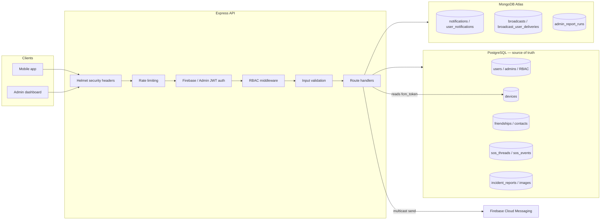

# Beacon Backend — Postgres + MongoDB Polyglot Implementation Plan
### (Revised to align with Checkpoint 2 guide — deployment phase excluded)

## 0. Scope and Governing Principle

PostgreSQL remains the system of record for everything with an atomicity, foreign-key, or concurrent-locking requirement. MongoDB Atlas takes ownership of the three domains that are already append-heavy, read-mostly, and treated as best-effort/non-transactional in the current codebase. Hybrid has been confirmed as acceptable for Checkpoint 2, so this plan now also closes the guide's security/RBAC/validation gaps identified in the compliance mapping — everything except the deployment phase, which is explicitly out of scope for now.

**Rule for every decision in this plan:** no single write operation may require both databases to commit together. If an operation currently needs "these writes succeed together or not at all," it stays entirely on one side of the boundary.

| Stays in PostgreSQL | Moves to MongoDB |
|---|---|
| `users`, `admins`, `roles`, `permissions`, `role_permissions` | `notifications` |
| `devices` | `user_notifications` |
| `emergency_contacts` | `broadcasts` |
| `friend_requests`, `friendships` | `broadcast_user_deliveries` |
| `incident_reports`, `incident_report_images` | `admin_report_runs` |
| `sos_threads`, `sos_events` | |
| `admin_requests` | |

---

## 1. Target Architecture



Key wiring rules unchanged from the original plan: no live cross-database joins, display fields denormalized into Mongo documents at write time, FCM dispatch and dead-token cleanup stay Postgres-adjacent regardless of which database triggered the send.

---

## 2. New Infrastructure

### 2.1 Connection layer

- `src/mongo.js`: Mongoose connection using `MONGODB_URI`, alongside the existing `src/db.js` Postgres pool. Both must connect before `server.js` listens; health endpoint probes both.
- Add `mongoose`, `helmet`, and (if not already present) `express-rate-limit` and `express-validator` to `package.json`.

### 2.2 New files

| File | Purpose |
|---|---|
| `src/mongo.js` | Mongoose connection lifecycle |
| `src/models/Notification.js` | Admin notification schema |
| `src/models/UserNotification.js` | App-user notification schema |
| `src/models/Broadcast.js` | Broadcast content + audience schema |
| `src/models/BroadcastDelivery.js` | Per-recipient delivery/ack schema |
| `src/models/AdminReportRun.js` | Report audit log schema |
| `src/middleware/validateMongoRequest.js` | Input validation for the new Mongo-backed routes |
| `src/middleware/auditLog.js` | Writes an audit entry for admin actions (satisfies the "audit logging" API-security control) |
| `scripts/initializeMongo.js` | Creates collections, indexes, validators before first traffic |
| `scripts/migrateNotificationsAndBroadcasts.js` | One-time historical data transfer for the 3 domains |
| `scripts/verifyPolyglotMigration.js` | Post-transfer record counts / spot-check comparison |
| `security-testing.md` | The guide's required test/expected/actual/status table, filled in against your own running app |
| `.env.example` | Updated to include `MONGODB_URI` alongside existing vars |

---

## 3. MongoDB Schema and Indexes

*(unchanged from the original plan — see below for the validation layer added on top)*

### 3.1 `notifications` (admin inbox)
```javascript
{
  _id: ObjectId,
  public_id: Number,
  recipient_admin_id: Number,
  type: String,
  title: String,
  message: String,
  metadata: Object,
  read: Boolean,
  created_at: Date
}
```
Indexes: unique `public_id`; compound `(recipient_admin_id, created_at)`.

### 3.2 `user_notifications`
Same shape with `recipient_user_id`. Same index pattern.

### 3.3 `broadcasts`
```javascript
{
  _id: ObjectId,
  public_id: Number,
  title: String,
  body: String,
  severity: String,        // announcement | warning | danger — enum-validated
  audience_type: String,   // all | role — enum-validated
  audience_roles: [String],
  audience_role_ids: [Number],
  created_by_admin_id: Number,
  active: Boolean,
  sent_at: Date,
  created_at: Date
}
```
Indexes: unique `public_id`; `created_at`; `sent_at`. Send-once guard: conditional `findOneAndUpdate({ _id, sent_at: null }, ...)`.

### 3.4 `broadcast_user_deliveries`
```javascript
{
  _id: ObjectId,
  broadcast_id: ObjectId,
  recipient_user_id: Number,
  delivered_at: Date,
  acknowledged_at: Date
}
```
Indexes: unique compound `(broadcast_id, recipient_user_id)`; `(recipient_user_id, delivered_at)`.

### 3.5 `admin_report_runs`
```javascript
{
  _id: ObjectId,
  public_id: Number,
  report_type: String,
  range_start: Date,
  range_end: Date,
  timezone: String,
  generated_by_admin_id: Number,
  generated_at: Date,
  content_hash: String
}
```
Indexes: unique `public_id`; compound `(report_type, range_start, range_end, timezone)`.

### 3.6 Counters
`counters` collection seeded from each table's current max ID, so IDs continue the existing sequence.

### 3.7 Mongoose-level validation (new — closes guide gap)

Every model above gets `required: true` on non-nullable fields, `enum: [...]` on `severity`/`audience_type`, and a `maxlength` on free-text fields (`title`, `body`, `message`). This is in addition to route-level `express-validator` checks below — the guide asks for validation both at the schema layer ("data validation" under Database requirements) and the request layer ("input validation" under Security requirements), so both are implemented rather than treating one as covering the other.

---

## 4. Security Controls Added to Match the Guide

These apply globally, not just to the new Mongo routes — the guide grades the whole API.

| Control | Implementation |
|---|---|
| **Helmet** | `app.use(helmet())` added once in `server.js`, before route mounting. |
| **Rate limiting** | Confirm existing rate limiting covers auth endpoints (`/admin/auth/login`, `/me/bootstrap`) specifically — the guide's demo checklist calls out "excessive login requests → blocked" as a named test case. |
| **Input validation on new routes** | `express-validator` chains on every notification/broadcast/report route: `isMongoId()` on path params, `isIn([...])` on `severity`/`audience_type`, `isISO8601()` on date ranges, body-shape checks before anything reaches Mongoose. |
| **RBAC role count** | Confirm whether "responders" is a permission tier distinct from "admins" in the current `role_permissions` table. If not, add a third role (`responder`) with its own scoped permissions (e.g., can view/ack SOS and incidents, cannot manage admins or send broadcasts) so the RBAC matrix has 3 genuinely different rows, matching the guide's minimum. |
| **RBAC matrix documentation** | Produce the explicit table (Function × Role) the guide shows, covering: view records, create records, update records, delete records, manage users, view admin dashboard, send broadcasts, resolve SOS. |
| **Secure error handling audit** | Review every catch block in the new notification/broadcast/report routes (and spot-check existing Postgres routes) to confirm no stack trace, Mongo/Postgres connection string, or JWT secret ever reaches a response body. Standardize on `{ data: null, error: { message: "..." } }` shape. |
| **Audit logging** | `src/middleware/auditLog.js` records admin actions (broadcast send, SOS resolution, admin creation) — satisfies the "audit logging" item in the guide's 4-of-N API security list. |
| **Env vars** | Add `MONGODB_URI` to `.env` and `.env.example`; confirm `JWT_SECRET` and `PORT` are already externalized (they should be, given the existing admin JWT setup) and that `.env` is in `.gitignore`. |
| **Database security (non-deployment part)** | Create a dedicated Atlas database user scoped to only this application's database (read/write on the Beacon DB only, not an Atlas admin role) — this is a configuration step independent of actually deploying anywhere, so it's in scope even with deployment excluded. |

---

## 5. Code Changes by File

| File | Change |
|---|---|
| `server.js` | Add `helmet()`, confirm rate limiter covers auth routes, await both DB connections before listening |
| `src/mongo.js` (new) | Mongoose connection |
| `src/middleware/validateMongoRequest.js` (new) | Shared validation chains for Mongo-backed routes |
| `src/middleware/auditLog.js` (new) | Audit-log writer, called from admin action routes |
| `src/routes/notificationRoutes.js` | Mongo-backed list/mark-read, validated |
| `src/services/userNotifications.js` | Persist to Mongo; device lookups still read Postgres |
| `src/services/fcm.js` | Delivery-scope query reads Mongo; token cleanup still Postgres |
| `src/routes/broadcastRoutes.js` | Mongo-backed create/send/list/inbox/ack, validated, audit-logged on send |
| `src/routes/adminBroadcastRoutes.js` | Same send-once logic as above |
| `src/routes/adminReportsRoutes.js` | `admin_report_runs` persistence to Mongo; report data queries stay on Postgres |
| `src/routes/sosRoutes.js`, `adminSosRoutes.js`, `incidentRoutes.js` | Unchanged persistence; notification-creation call retargets to Mongo; SOS resolution now audit-logged |
| `src/routes/deviceRoutes.js` | Unchanged |
| `src/middleware/requireRole.js` (new or extended) | RBAC middleware updated for the third role if `responder` is added |

---

## 6. Migration Phases

| Phase | Work | Gate |
|---|---|---|
| **1. Infrastructure & global security** | Provision Atlas cluster (app-scoped DB user), add `mongoose`/`helmet`/validator deps, build `src/mongo.js`, add Helmet, confirm rate limiting on auth routes | Health check covers both DBs; Helmet headers visible on any response |
| **2. Schemas, indexes, validation** | 5 Mongoose models with schema-level validation, `initializeMongo.js` | Invalid documents rejected at the schema layer in a scratch test |
| **3. RBAC confirmation** | Confirm/add third role, update permission matrix and middleware | 403 returned for role-mismatched requests across all three roles |
| **4. Historical data transfer** | `migrateNotificationsAndBroadcasts.js` | Row counts and spot-checked records match |
| **5. Notifications cutover** | Repoint routes/services at Mongo, add `express-validator` chains | Inbox list/mark-read pass tests against Mongo-backed data |
| **6. Broadcasts cutover** | Repoint routes at Mongo, add validation, wire audit logging on send | Send-once guard holds under concurrency; audit entry created per send |
| **7. Reports cutover** | `admin_report_runs` to Mongo | Report output matches pre-migration baseline |
| **8. Security hardening pass** | Error-handling audit across all routes (old and new), env var cleanup, `.env.example` update | No stack traces/connection strings/secrets appear in any error response, sampled across routes |
| **9. Security testing table** | Run and record the guide's required test scenarios (see §7) | All listed tests produce the expected status code |
| **10. Regression pass** | Full existing suite plus new Mongo/security tests | SOS/incident/friendship domains unaffected |

*(Deployment/cutover-to-production is intentionally not phased here — out of scope for now per current instructions.)*

---

## 7. Security Testing Table (guide-required format)

To be filled in by actually running each test against the running (non-deployed, local/staging) app:

| Test | Expected Result | Actual Result | Status |
|---|---|---|---|
| Invalid broadcast payload (bad enum value) | 400 Bad Request | | |
| Invalid/missing Firebase token on protected mobile route | 401 Unauthorized | | |
| Invalid/expired admin JWT | 403 Forbidden | | |
| Access admin-only route as regular user | 403 Forbidden | | |
| Access responder-only route as regular user | 403 Forbidden | | |
| Invalid MongoDB ObjectId in route param | 400 Bad Request | | |
| Unauthorized broadcast delete/send by non-admin | 403 Forbidden | | |
| Excessive login attempts on admin login | Rate limited | | |
| Error response inspected for leaked internals | No stack trace / connection string / secret present | | |

---

## 8. Functional Testing Checklist (from the original plan, retained)

- [ ] Notification list/mark-read scoped correctly per recipient.
- [ ] Concurrent broadcast send/publish cannot both mark a broadcast sent.
- [ ] Broadcast audience precedence resolves identically to pre-migration behavior.
- [ ] Delivery records are a complete, unregenerated snapshot at send time.
- [ ] FCM dead-token cleanup still deletes from Postgres `devices` correctly.
- [ ] SOS/incident/friendship endpoints unaffected — regression suite passes unchanged.
- [ ] Report generation numbers match the pre-migration baseline exactly.
- [ ] Historical IDs preserved through the transfer script.
- [ ] Health endpoint reports degraded status if either database is unreachable.
- [ ] Startup fails cleanly if MongoDB is unreachable at boot.

---

## 9. Rollback Strategy

Unchanged from the original plan — each cutover phase (5–7) is independently revertible by pointing routes back at Postgres, and the original Postgres tables for notifications/broadcasts/reports stay intact and unwritten-to until the checkpoint is accepted.

---

## 10. Deliverables (deployment-independent subset)

Per the guide, excluding anything that requires an actual hosted environment:

- [ ] GitHub repository reflecting the client/server/models/routes/controllers/middleware separation.
- [ ] Test accounts for all 3 roles (admin / responder / user), with credentials noted for demo purposes only.
- [ ] Security documentation: RBAC matrix, authentication mechanisms (Firebase + JWT, explained side by side), password-hashing note (bcrypt on admin side, Firebase-managed on mobile side), the completed security testing table above.
- [ ] `.env.example` with `MONGODB_URI`, `JWT_SECRET`, `PORT`, and any Firebase config vars already in use.
- [ ] System architecture diagram (§1 above) and a MERN-style data-flow diagram showing both databases explicitly, since the guide expects one and your architecture has a documented reason to differ from the default.

Live URLs, HTTPS verification, and hosted-database configuration evidence are deferred until the deployment phase is picked back up.

---

## 11. Final Checklist

- [ ] Atlas cluster provisioned with an app-scoped (not admin) database user.
- [ ] Five Mongoose models with schema-level validation created via `initializeMongo.js`.
- [ ] Historical data transferred and verified for all three domains.
- [ ] Helmet, rate limiting, and audit logging confirmed active globally.
- [ ] RBAC has 3 genuinely distinct roles with a documented matrix and 403 behavior verified.
- [ ] Input validation active on every new Mongo-backed route.
- [ ] Error responses across the whole API reviewed for leaked internals.
- [ ] `MONGODB_URI` and other secrets externalized; `.env.example` updated; `.env` confirmed git-ignored.
- [ ] Security testing table completed with real results.
- [ ] No code path requires a Postgres transaction and a Mongo write to succeed together.
- [ ] Full existing test suite passes; new Mongo/security tests added.
